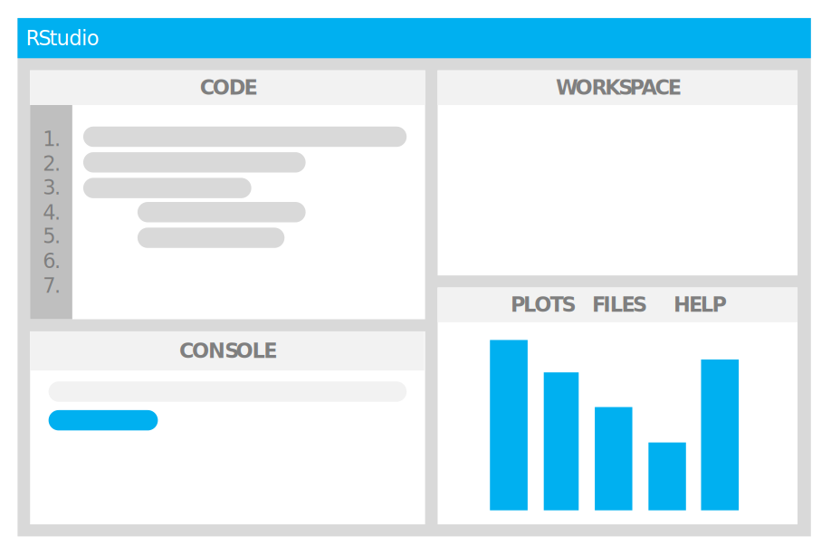
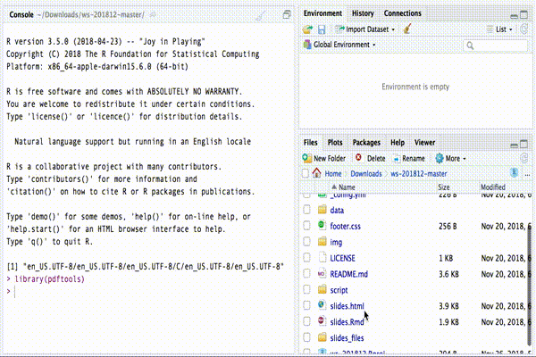

## R and RStudio

In order to replicate the code used in this tutorial on your computer, you need to install R and RStudio (they are both open source and free). You can download the version for your computer here:

* [R](https://cran.r-project.org/mirrors.html) (select the mirror closest to your geographic location)
* [RStudio](https://www.rstudio.com/products/rstudio/#Desktop)

Once you have installed R and RStudio, you need to open RStudio. RStudio looks more or less like this:



## Dowload the workshop archive

You can download the archive of the workshop by clicking [here](https://github.com/Digital-Methods-Sydney/ws-201812/archive/master.zip). Move the `ws-201812-master.zip` archive somewhere on your computer (like on your desktop) and open it. You should now have a folder containing a number of files and folders: 

```{r, echo=FALSE}
print(list.files())
```

Double-click on the file `ws-201812.Rproj`; it should open in RStudio. If this doesn't work, go to RStudio, and "File" → "Open project..." and open `ws-201812.Rproj`.

## RStudio interface 

If you haven't changed the order of the different regions, you should see the different **FILES** of the project in your "bottom-right region". In the same region, there are other windows (e.g. **PLOTS** and **HELP**) you can navigate by clicking on the corresponding tab. In the the window **FILES** you can access all the code files in the folder `script`. 

When you open a code file (that is, every file with `.R` as extension), the text file containing the R **CODE** appears in the *top-left region*. 

To execute a part of the code you can simply highlight the corresponding text and click on "Run" button, at the top of the **CODE** region.



## Packages you need to install

In this workshop we will use a number of packages. Make sure that you have all the packages installed before attending the worksops by running these two chunks of code: 

```{r packages}
ws_packages <- 
  c('stm', 'tidyverse', 'tidytext', 'tidytext',
    'xml2', 'pdftools', 'stringr',
    'gutenbergr', 'jsonlite', 'tsne')
```

```{r, eval=F}
install.packages(ws_packages)
```

To run the code, just copy-paste the code into your RStudio **CONSOLE** and hit the Return/Enter Key.

Finally to test that all packages load correctly run this (and checks if return only a list of `TRUE`s):

```{r}
lapply(ws_packages, require, character.only = TRUE)
```


